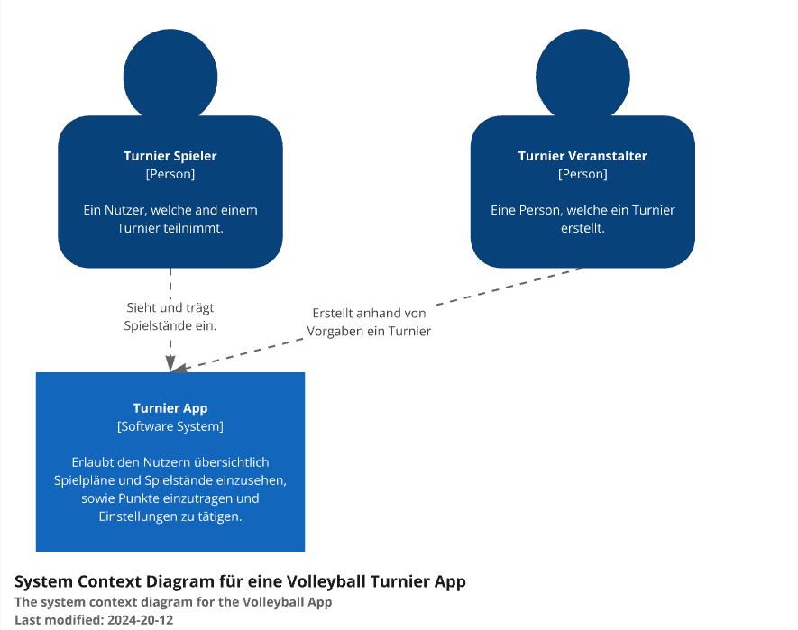
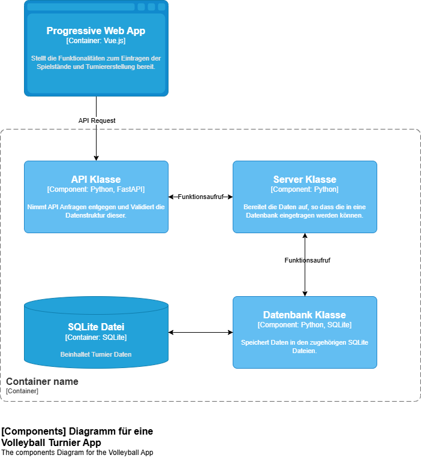
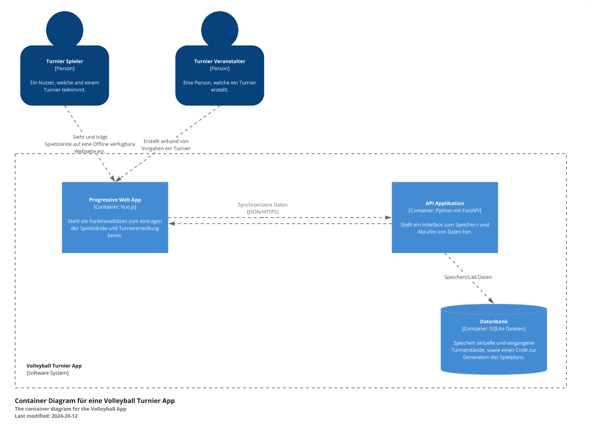
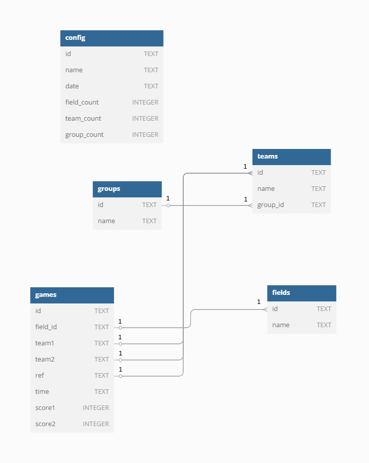

# Architecture Documentation

## Purpose

This document describes the **philosophy, decisions, constraints, rationale, key elements**, and other **cross-cutting concerns** of the tournament management system that influence its design and implementation.

## Architectural Goals and Philosophy

The architecture emphasizes **simplicity, modularity, and maintainability** across devices and environments supporting both **offline** and **online** use cases. It should be intuitive for development, flexible for expansion, and simple to deploy.

### Key Goals

- Offline and online usage support  
- Simple programming model and clean structure  
- Unified syntax and coding conventions  
- Easy compilation and testing  
- Lightweight and reliable deployment  
- Maintainability and future extensibility  
- Local data storage and synchronization  
- Cross-platform and multi-device support  
- Match schedule export (e.g., PDFs)  
- No strict performance or security requirements  

## Assumptions and Dependencies

- Users have a modern web-enabled (mobile or desktop) device
- Existing Excel tournament sheets must be supported
- Development team is familiar with:
  - Python
  - Vue.js
  - SQLite
- No external authentication or cloud service dependency  

## Architecturally Significant Requirements

- Persistent local storage
- Offline-first behavior
- Cross-device synchronization via QR codes
- Browser-based platform independence
- Live match tracking
- Fast load times
- Lightweight, efficient codebase
- PDF export of schedules
- English as a supported language

## Key Decisions, Constraints, and Rationale

### Database
**SQLite** is selected for its:
- Lightweight footprint
- Built-in persistence
- Minimal setup

### Backend/API
**FastAPI** is used to:
- Provide fast, asynchronous REST APIs  
- Enable clean code separation  
- Simplify developer onboarding  

### Frontend
**Vue.js** is used, because it offers:
- Simplicity and modularity  
- Strong PWA support for offline use  
- Component-based development  

### Cross-Device Support
**PWA** (Progressive Web App) is chosen to:
- Ensure cross-platform functionality  
- Enable offline access  
- Better user experience

### Data Sync Strategy
**QR codes** are used for:
- Peer-to-peer data exchange  
- Serverless synchronization  

## Architectural Mechanisms

### Availability
- **Offline-first** PWA architecture  
- App remains functional once cached  

### Event Management
- **Synchronous** for UI interactions  
- **Asynchronous** for API calls and sync  

### Information Exchange
- With **JSON** payloads for all data  

### Localization
- Multilingual via `i18n`  
- Initial support: **German** and **English**  

### Persistence
- Local persistence via:
  - **SQLite** on backend  
  - **Pinia Store** on frontend  

## Architectural Layers / Frameworks

| Layer          | Description |
|----------------|-------------|
| **Frontend**   | Built with Vue.js: UI, routing, i18n, PWA behavior |
| **API Layer**  | FastAPI: REST API for scheduling, export, persistence |
| **Storage**    | SQLite: Embedded relational DB for persistent data |

## Architectural Views

### System Diagrams

