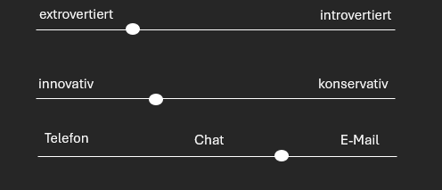
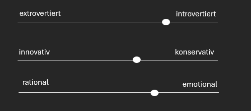
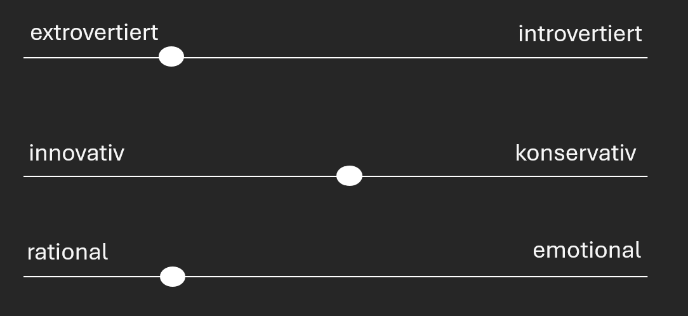

# Personas

## Persona: Peter – The Client

### Demographics

* **Age:** 24
* **Gender:** Male
* **Marital Status:** Single
* **Location:** Dresden
* **Employer:** HTW Dresden
* **Occupation:** Student

### Technical Skills

* Computer science student in the 5th semester
* Uses Apple iOS
* Uses Microsoft Office products
* Frequently uses a smartphone
* Works with many different software applications

### Needs / Goals

* Wants new software for volleyball tournament management
* Seeks simplification of the current process
* Values professional communication
* Aims to successfully complete his studies

### Obstacles / Frustrations

* Not always reachable
* No clear vision for solving technical problems

### Behavioral Variables

## Persona: Klara – Competitive Team Player

### Demographics

* **Age:** 21
* **Gender:** Female
* **Marital Status:** Single
* **Location:** Dresden
* **Employer:** HTW Dresden
* **Occupation:** Student

### Technical Skills

* Education major in the 2nd semester
* Uses Android
* Uses Microsoft Office products
* Frequently uses a smartphone
* Uses only a few specific programs

### Needs / Goals

* Wants to play volleyball
* Wants to participate in and win the tournament
* Wants to test and showcase her skills
* Wants minimal involvement in organization
* Wants easy-to-use software with clear instructions
* Aims to successfully complete her studies

### Obstacles / Frustrations

* No personal contact with organizers
* May have individual needs

### Behavioral Variables

## Persona: Tim – Casual Team Player

### Demographics

* **Age:** 20
* **Gender:** Male
* **Marital Status:** Single
* **Location:** Dresden
* **Employer:** HTW Dresden
* **Occupation:** Student

### Technical Skills

* Business informatics student in the 4th semester
* Uses Apple iOS
* Uses Microsoft Office products
* Frequently uses a smartphone
* Uses several different programs

### Needs / Goals

* Wants to play volleyball
* Wants to join the tournament for fun
* Wants minimal involvement in organization
* Wants simple software with clear/easy instructions
* Aims to successfully complete his studies

### Obstacles / Frustrations

* No personal contact with organizers
* May have individual needs

### Behavioral Variables

