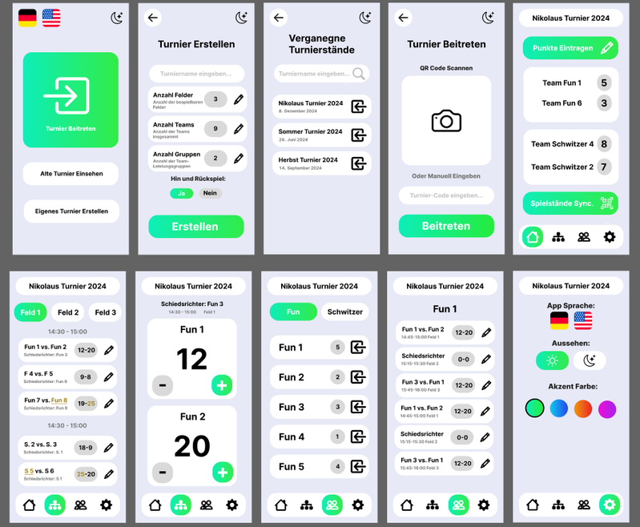
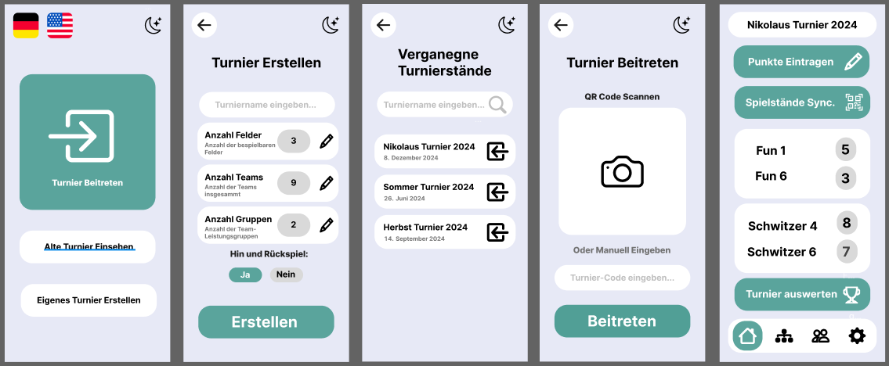
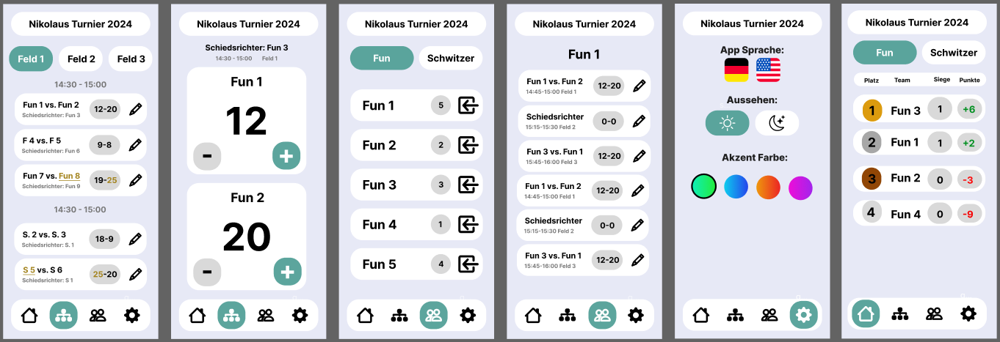
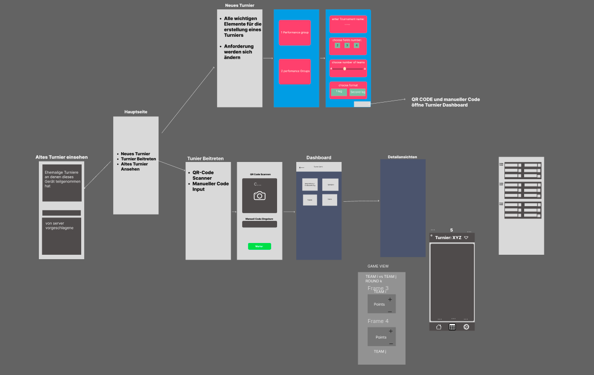

# Wireframe Documentation

This document outlines the structure and visual language of the tournament app based on the wireframe. The wireframe serves as a conceptual blueprint for core user flows and interface components.

## Design Style

The wireframe adopts a minimalist and functional design language. Key characteristics include:

- **Structured Layouts**: Screens are organized in clear vertical and horizontal sections, supporting logical grouping of actions and data.
- **Card-Based Elements**: Modular blocks present information in consistent card formats.
- **Neutral Color Usage**: Backgrounds are neutral, placing emphasis on interactive elements. High contrast colors are reserved for actions like buttons or highlights (not shown in the wireframe).
- **Typography & Hierarchy**: Elements often use icons to quickly tell a user what the element is all about.

## First App Design

## Updated App Design

## Wireframe Components

### 1. **Main Navigation (Home)**
- Central hub with links to:
  - Join Tournament
  - Create New Tournament
  - View Past Tournaments

### 2. **Join Tournament**
- Two-method joining:
  - QR Code Scanner
  - Manual Code Entry
- Leads to the tournament dashboard

### 3. **Create Tournament**
- Input components for:
  - Tournament name
  - Number of fields
  - Number of teams
  - Number of groups
  - Return game
- Final Create Button initiates the tournament setup

### 4. **Past Tournaments**
- Scrollable list of previously accessed tournaments:
  - Server stored tournaments
- Clickable cards with name, date and access buttons

### 5. **Dashboard**
- Displays best team grouped by performance group

### 6. **Match Details View**
- List of matches by team or group
- Game View:
  - Team vs. Team display
  - Points per team
  - Game start time

## Flow Overview

- **Start at Home** → Choose to Create, Join, or View
- **Join/Create** → Leads to Dashboard
- **Dashboard** → Navigates to Match Detail Views
- **Detail View** → Score input & updates

## Wireframe Preview

This wireframe reflects an app designed for simplicity and user efficiency during live tournament management. The modular layout enables scalability as future features are added.
