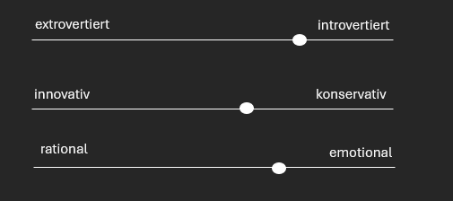

= Personas: 

== Persona: Peter Auftraggeber

=== Demographie:
- **Alter:** 24
- **Geschlecht:** männlich
- **Familienstand:** ledig
- **Wohnort:** Dresden
- **Arbeitgeber:** HTW Dresden
- **Beruf:** Student

=== Technische Fähigkeiten:
- Informatikstudent im 5. Semester
- Verwendet Apple iOS
- Verwendet Microsoft-Office-Produkte
- Verwendet das Smartphone oft
- Verwendung von vielen verschiedenen Programmen

=== Bedürfnisse/Ziele:
- will neue Software für Volleyballturnier
- Vereinfachung der jetzigen Situation
- Professionelle Kommunikation
- Studium erfolgreich abschließen

=== Hindernisse/Frustration:
- Nicht immer erreichbar
- Keine konkrete Vorstellung für Lösung von technischen Problemen

=== Verhaltensvariablen:

image::images/peterVerhaltensvariablen.png[alt="Verhaltensvariablen Peter Grafik", width=400]

== Persona: Team Schwitzer Klara

image::images/klara.png[alt="Persona Klar Teilnehmer",width=300,align=left]

=== Demographie:
- **Alter:** 21
- **Geschlecht:** weiblich
- **Familienstand:** ledig
- **Wohnort:** Dresden
- **Arbeitgeber:** HTW Dresden
- **Beruf:** Student

=== Technische Fähigkeiten:
- Lehramt Studentin im 2. Semester
- Verwendet Android
- Verwendet Microsoft-Office-Produkte
- Verwendet das Smartphone oft
- Verwendung von einzelnen Programmen

=== Bedürfnisse/Ziele:
- will Volleyball spielen
- will am Turnier teilnehmen und gewinnen 
- will ihre Fähigkeiten testen und zeigen
- will so wenig wie möglich mit der Organisation zu tun haben
- will einfache Software haben mit genauen Anleitungen
- Studium erfolgreich abschließen

=== Hindernisse/Frustration:
- Kein persönlicher Kontakt
- Kann individuelle Bedürfnisse haben

=== Verhaltensvariablen:

== Persona: Team Fun Tim

image::images/Picture 3.png[alt="Persona Peter Auftraggeber",width=300,align=left]

=== Demographie:
- **Alter:** 20
- **Geschlecht:** männlich
- **Familienstand:** ledig
- **Wohnort:** Dresden
- **Arbeitgeber:** HTW Dresden
- **Beruf:** Student

=== Technische Fähigkeiten:
- Wirtschaftsinformatik Student im 4. Semester
- Verwendet Apple iOS 
- Verwendet Microsoft-Office-Produkte
- Verwendet das Smartphone oft
- Verwendung mehrerer Programme

=== Bedürfnisse/Ziele:
- will Volleyball spielen
- will am Turnier teilnehmen um Spaß zu haben 
- will so wenig wie möglich mit der Organisation zu tun haben
- will einfache Software haben mit genauer/einfacher Anleitung
- Studium erfolgreich abschließen

=== Hindernisse/Frustration:
- Kein persönlicher Kontakt
- Kann individuelle Bedürfnisse haben

=== Verhaltensvariablen:

